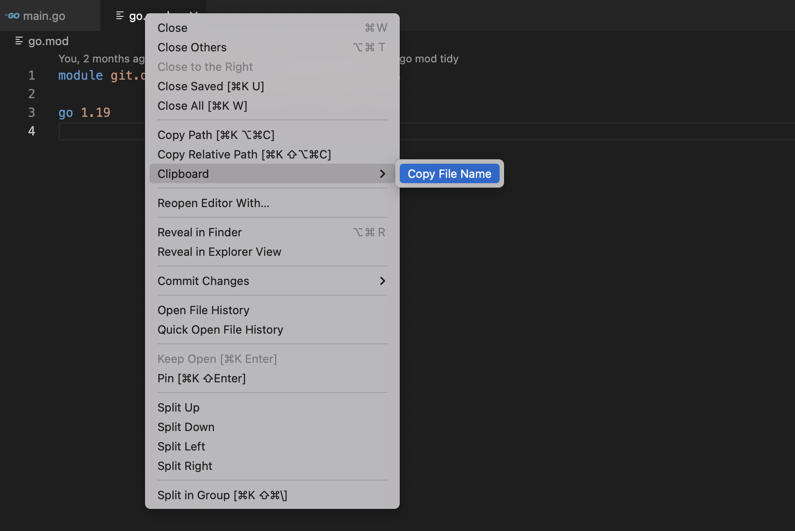

# Clipboard

Clipboard is an extension for [Visual Studio Code](https://code.visualstudio.com).

Clipboard extension provides the functionality to copy the file name in the system clipboard.

## Installation

This extension is not available in the [Visual Studio Code Marketplace](https://marketplace.visualstudio.com/vscode). Follow the below steps to install this extension:

1. Clone this repository in your machine.
2. Install [vcse](https://github.com/microsoft/vscode-vsce).
3. Run `vsce package` in the extension repository to package your extension into a VSIX file.
4. Install the generated VSIX file in your vscode.

## Authors

- [@pratyush.gupta](https://github.com/pratyush05)
