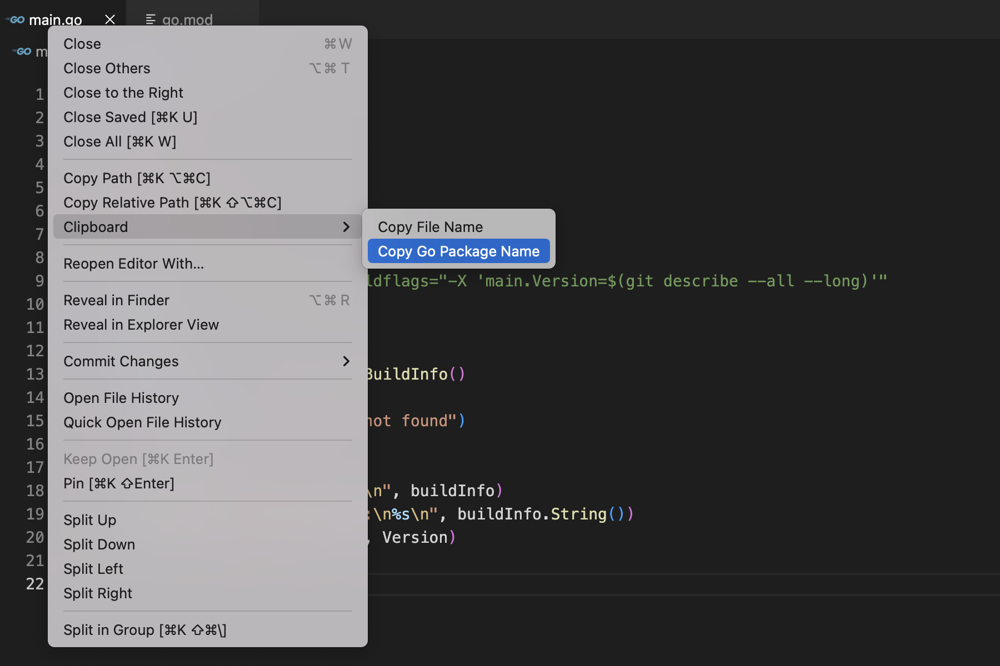

# Clipboard

Clipboard is an extension for [Visual Studio Code](https://code.visualstudio.com).

## Installation

This extension is not available in the [Visual Studio Code Marketplace](https://marketplace.visualstudio.com/vscode). Follow the below steps to install this extension manually:

1. Clone this [repository](https://github.com/pratyush05/vscode-clipboard) in your machine.
2. Install [vcse](https://github.com/microsoft/vscode-vsce).
4. Run `vsce package` to package your extension into a VSIX file.
5. Install the VSIX file in your [vscode](https://code.visualstudio.com/docs/editor/extension-marketplace#_install-from-a-vsix).

## Features

1. Copy the name of the file.

2. Copy the package name of the Go file.

## Authors

- [@pratyush.gupta](https://github.com/pratyush05)
